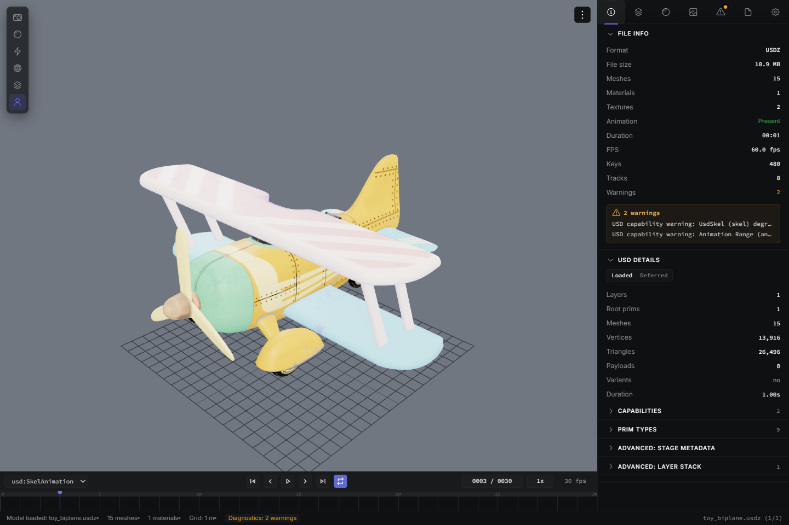

# yw-look

**A 3D model viewer for quick inspection.**

Open the model. Find its textures. Inspect the scene. Get the context you need
before bringing an asset into your DCC.



## Download

Current releases are for Windows x64.

**[Download for Windows](https://github.com/yohawing/yw-look/releases/latest)**

Run the installer, then drag a file into the window. If you register the file
types, a double-click opens the asset as well. Windows builds are not signed, so
Windows may show a warning. There is no general macOS release yet.

## What you can inspect

**Open a 3D asset in one step.** Drag a new asset into yw-look and it opens. You
do not need to install a heavy DCC tool.

**See detailed file information.** The sidebar shows details about the asset:
polygon count, number of materials, draw calls, and more.

**Find problems in an asset.** Data that could not be loaded and features that
are not supported appear as warnings. You can see missing texture references or
unsupported skeletons before you open the file in your DCC.

**Check motion data in detail.** Switch between the loaded clips on the timeline
editor. Play, pause, step frames, and change the speed while you watch the
bones. Set a loop range to check one part again and again.

**Check textures in the image view.** List the textures loaded with the model and
filter them by name or channel, such as Base Color or Normal. Open a texture and
zoom in to check the details.

**Check material settings.** The material list shows the shader type, texture
bindings, and parameters such as base color, metallic, and roughness. Search
narrows the list down even when there are hundreds of materials.

## Supported formats

Support describes what can be previewed or inspected. It does not guarantee that
every shader, rig, or feature from the authoring application is reproduced.

### 3D models and motion

| Format     | What to expect                                                                                    |
| ---------- | ------------------------------------------------------------------------------------------------- |
| glTF / GLB | Models, materials, and animation. External textures and buffers must remain available.            |
| FBX        | Models, textures, and animation. Application-specific shaders and rigs are not fully reproduced.  |
| OBJ        | Static meshes, with MTL and external texture references.                                          |
| PLY / STL  | Mesh inspection; PLY also supports point clouds. Gaussian Splat PLY files need the separate pack. |
| COLLADA    | Models and external textures. Animation clips are not imported.                                   |
| Alembic    | Mesh geometry and vertex animation, using the corresponding native helper.                        |
| BVH        | Skeleton and motion. This format does not contain a model surface.                                |

### USD stages

USD, USDA, USDC, and USDZ support includes geometry, materials, some animation,
and inspection of layers, Prims, variants, references, and payload information.
Support is partial: UsdSkel, MaterialX, and other features have limitations.
Read the warnings for the specific asset you open.

### Images and textures

| Format                       | Notes                                                         |
| ---------------------------- | ------------------------------------------------------------- |
| PNG, JPEG, TGA, HDR, OpenEXR | Image preview.                                                |
| DDS, KTX2                    | Compression and runtime support affect what can be displayed. |
| PSD                          | A composite image preview, not a layer editor.                |

### Loader packs

| Pack or setting | Formats and limits                                                                                                                                                                         |
| --------------- | ------------------------------------------------------------------------------------------------------------------------------------------------------------------------------------------ |
| CAD Loader Pack | IFC, Rhino 3DM, and 3MF. Rhino editing, Grasshopper execution, and full display-mode reproduction are not supported. 3MF external models and unsupported required extensions are rejected. |
| VRM             | VRM models. VRMA is not implemented.                                                                                                                                                       |
| MMD             | PMD, PMX, and VMD. MMD-specific bone constraints have limitations.                                                                                                                         |
| Gaussian Splat  | PLY, SPLAT, SPZ, KSPLAT, and SOG.                                                                                                                                                          |

Check pack availability and enabled status in Settings. A pack requirement does
not mean a feature is paid-only.

## Command line

The `yw-look` command checks whether a model loads and writes a PNG. Add the
folder that holds the executable to your PATH, or call the executable by its
full path. No development tools are needed.

```bash
# Report success or failure through the exit code
yw-look --check --in "path/to/model.fbx"

# Write a single model to a PNG
yw-look --shot --in "path/to/model.glb" --out "out.png" --size 1920x1080 --bg transparent
```

`--in` is the input file and `--out` is where the PNG is written. `--size` and
`--bg` are optional.

## Supporter edition

yw-look is free. The supporter edition helps keep development going, and
supporters receive beta builds with new features before the free release. It is
sold on [BOOTH](https://yohawing.booth.pm/).

Please try the free edition with your own files before buying.

## Reporting a problem

Open the
[bug report form](https://github.com/yohawing/yw-look/issues/new?template=bug_report.yml).
Pasting the output of **Copy Diagnostics**, in the app's Diagnostics tab, makes
a report much easier to act on.

Diagnostics include local file paths and asset names. Please check what you are
sharing before you post. The app sends no telemetry, and it never uploads logs
or diagnostics on its own.

## About this repository

This repository carries the downloads and the bug report form. The application
source is not published here.

- [Changelog](CHANGELOG.md)
- [Terms of use](LICENSE.md), including commercial production work
- [Third-party licenses](THIRD_PARTY_NOTICES.md)
